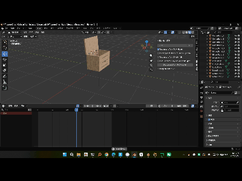

# Blender Model Generator

AI 驱动的 Blender 3D 建模 Skill，通过自然语言描述生成生产级 3D 资产。

---

## 快速开始

```bash
/blender-model-generator "一个木质桌子"
```

**首次使用**会自动检测环境并引导你完成设置（约 5 分钟）。

---

## 功能特点

- 🎯 **自然语言建模** - 用描述代替手动建模
- 🤖 **Multi-Agent 协作** - 5 个专业 Agent 分工协作
- 👀 **实时可视化** - 在 Blender GUI 中看到建模过程
- 📦 **完整输出** - 模型 + 动画 + 材质 + 文档 + 集成指南
- 🎮 **平台适配** - 支持 Unity、Unreal、Three.js

---

## 使用示例

```bash
# 简单模型
/blender-model-generator "一个木质桌子"

# 带动画
/blender-model-generator "办公椅，可以旋转和调节高度"

# 游戏资产
/blender-model-generator "宝箱，带开关动画" --type game --target unity

# 数字孪生
/blender-model-generator "充电桩，带状态显示和插枪动画" --type digital-twin --target unity
```

---

## 安装设置

### 前置要求

1. **Blender 3.0+**
2. **Python 3.10+**
3. **uv 包管理器**

### 一键设置

运行 skill 会自动检测环境并引导你：

```bash
/blender-model-generator test
```

### 手动设置（如果自动失败）

#### 步骤 1: 安装 uv

**Windows:**
```powershell
powershell -c "irm https://astral.sh/uv/install.ps1 | iex"
```

**Mac:**
```bash
brew install uv
```

**Linux:**
```bash
curl -LsSf https://astral.sh/uv/install.sh | sh
```

⚠️ 安装后必须**重启终端**

#### 步骤 2: 添加 MCP 服务器

```bash
claude mcp add blender uvx blender-mcp
```

⚠️ 配置后必须**重启 Claude Code**

#### 步骤 3: 安装 Blender 插件

1. 打开 Blender
2. Edit → Preferences → Add-ons
3. 点击 "Install..." 选择 `addon.py`
4. 勾选启用 "Interface: Blender MCP"

#### 步骤 4: 启动连接

1. 在 Blender 中按 `N` 打开侧边栏
2. 切换到 "BlenderMCP" 标签
3. 点击 "Connect to Claude"
4. 看到 "Server running" 即成功

✅ 完成后重新运行 skill！

---

## 输出内容

生成的资产包包含：

```
AssetName_Package/
├── models/
│   ├── asset.blend          # Blender 源文件
│   ├── asset.fbx            # 导出模型（Unity/Unreal）
│   └── previews/            # 多角度预览图
├── scripts/
│   ├── blocking_model.py    # 概念脚本
│   └── production_model.py  # 生产脚本（可复现）
└── documentation/
    ├── api_spec.json        # API 规范
    └── integration_guide.md # 平台集成指南
```

---

## 故障排除

### 错误："无法连接到 Blender"

✓ 检查 Blender 是否打开
✓ 检查插件是否启用
✓ 检查是否点击了 "Connect to Claude"
✓ 尝试重启 Blender

### 错误："找不到 uvx 命令"

✓ 确认已安装 uv
✓ 重启终端
✓ Windows 检查环境变量 PATH

### 错误："MCP 工具不可用"

```bash
# 添加 MCP 服务器
claude mcp add blender uvx blender-mcp

# 重启 Claude Code
```

---

## 技术架构

```
Claude Code (Skill)
    ↓ 使用 MCP Tools
BlenderMCP Server (uvx blender-mcp)
    ↓ Socket 连接 (localhost:9876)
Blender Addon (GUI 模式)
    ↓ bpy API 实时执行
Blender 窗口 ← 用户实时可见！
```

---

## Multi-Agent 工作流

1. **需求分析师** - 解析需求、搜索参考图、生成技术规格
2. **概念设计师** - 创建设计方案和阻塞模型
3. **技术审查师** - 验证结构和功能需求
4. **资产构建师** - 生成完整模型、动画、材质
5. **质量保证** - 测试、生成文档和集成指南

---

## 适用场景

### ✅ 适合

- 工业设备（充电桩、ATM、自动售货机）
- 家具（桌椅、柜子、床）
- 游戏道具（宝箱、武器、工具）
- 建筑元素（门、窗、楼梯）

### ❌ 不适合

- 复杂有机模型（人物、动物）
- 高度艺术化的造型
- 需要精细雕刻的模型

---

## 文件说明

- **SKILL.md** - Skill 主文件（AI 读取）
- **README.md** - 本文件（用户文档）
- **addon.py** - Blender 插件文件
- **references/** - 代码模板和 Schema 定义

- **SKILL.md** - Skill 主文件（AI 读取）
- **README.md** - 本文件（用户文档）
- **references/** - 代码模板和 Schema 定义
- **addon.py** - Blender 插件文件

---

## 效果



## 许可

- **BlenderMCP**: 见 `ahujasid/blender-mcp`
- **Skill 代码**: MIT License

**贡献**: BlenderMCP 由 [Siddharth Ahuja](https://github.com/ahujasid) 创建

---

**开始创建你的第一个 3D 模型！** 🚀

```bash
/blender-model-generator "你想要的模型描述"
```
